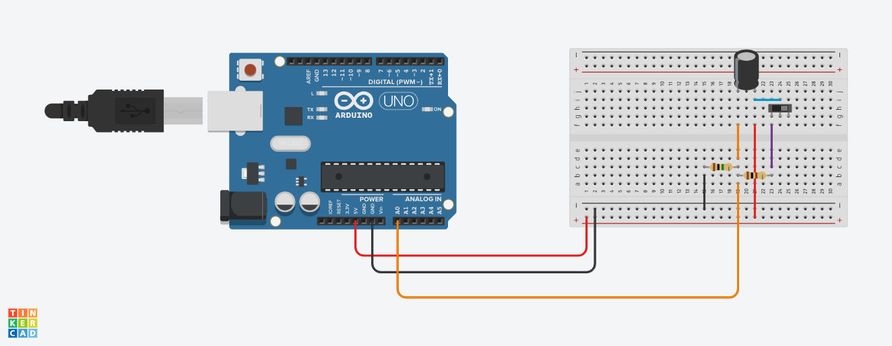
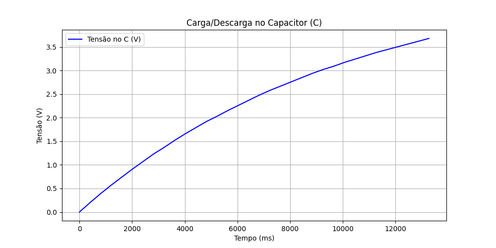
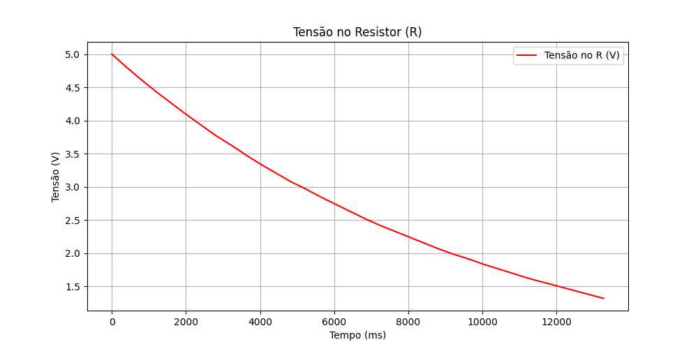
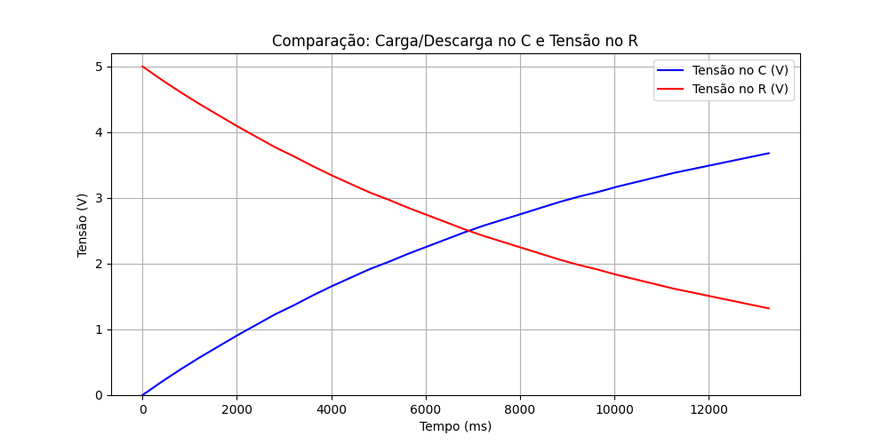
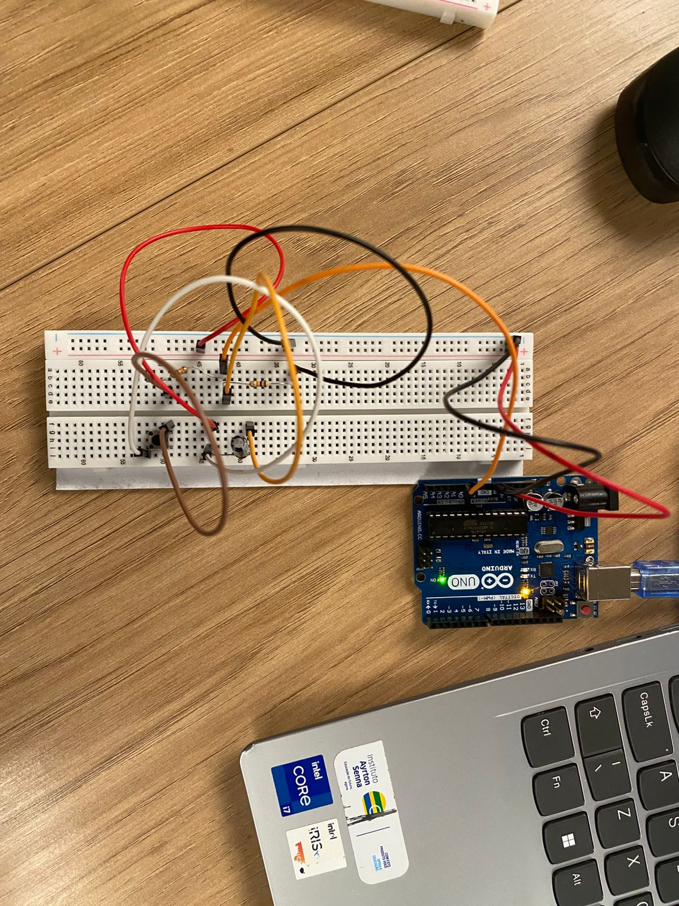

# Documentação do Experimento — Carga/Descarga de Capacitor (RC)

## Resumo
Experimento para analisar a resposta temporal de um circuito RC em carga/descarga. Foram coletados dados do Monitor Serial (tempo em ms, tensão no resistor R e tensão no capacitor C) e gerados gráficos comparativos e de verificação da soma das tensões (V_C + V_R).

## Objetivo
- Medir a curva de carga/descarga do capacitor.
- Verificar a conservação de energia/lei das malhas (V_C + V_R ≈ V_alim).
- Plotar e comparar tensões de R e C no tempo.

## Materiais
- Protoboard
- Resistor (valor conforme experimento)
- Capacitor (valor conforme experimento)
- Arduino (ou outro microcontrolador compatível)
- Cabos e fonte 5 V
- Computador com Python, pandas e matplotlib

## Circuito (Tinkercad)
Visualize e edite o circuito no Tinkercad:
https://www.tinkercad.com/things/kzIQcWJX1Fr/editel?returnTo=%2Fdashboard%2Fdesigns%2Fcircuits&sharecode=8FxoQloUpJ5SzbhbzSaP0sudgivilxIII2L2n3z0oMQ

Imagem do circuito (coloque o arquivo na pasta `assets/` do projeto):

## Procedimento
1. Monte o circuito conforme o diagrama do Tinkercad.
2. Ligue o Arduino e abra o Monitor Serial.
3. Dispare a carga/descarga e copie os dados do Monitor Serial para o script `graficos.py` (ou salve em `.csv` com colunas: Tempo (ms), Tensão R (V), Tensão C (V)).
4. Execute `graficos.py` para gerar os gráficos.

## Formato dos dados
O script atual espera linhas com três campos separados por espaço:

<tempo_ms> <tensao_R_V> <tensao_C_V>

Exemplo:

0 5.00 0.00

401 4.80 0.20

...

## Processamento dos dados
- O arquivo `graficos.py` usa pandas para ler os dados via `io.StringIO` e matplotlib para gerar os gráficos.
- Recomenda-se salvar os gráficos na pasta `assets/` com nomes claros para inclusão na documentação.

## Resultados (sugestão de imagens)
- Gráfico da tensão no capacitor ao longo do tempo:
  
- Gráfico da tensão no resistor ao longo do tempo:
  
- Gráfico comparativo (V_C e V_R):
  

## Projeto físico — montagem e resultados

### Foto do projeto montado

  

### Montagem física (resumo)
- Use a mesma ligação mostrada no Tinkercad.
- Verifique conexões: GND comum, resistor em série com o capacitor, pontos de medição do R e do C para o Arduino.
- Fonte: 5 V (Arduino). Anotar valores reais de R e C usados (ex.: R = 10 kΩ, C = 10 µF).

### Gráficos dos resultados (do projeto físico)

- Tensão no capacitor (medido):
  
- Tensão no resistor (medido):
  
- Comparativo C e R (medido):
  

